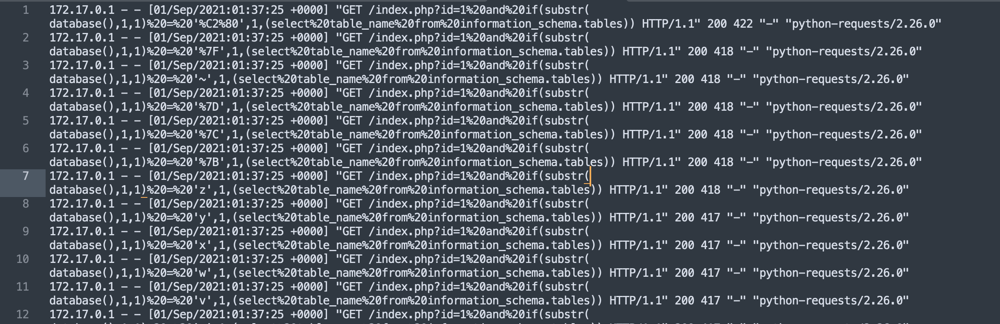
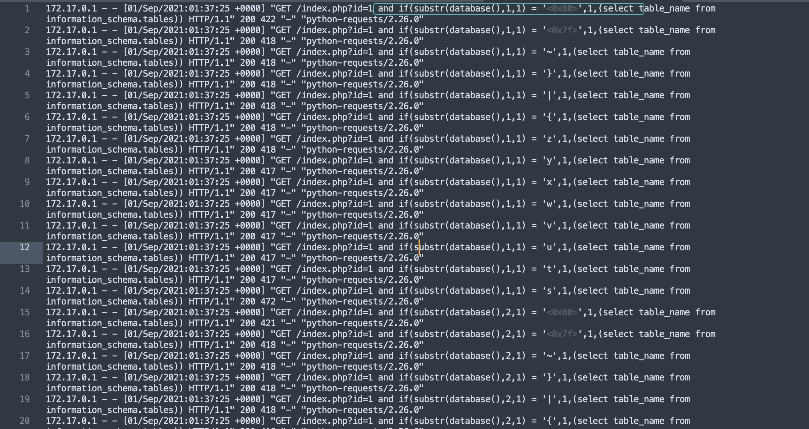
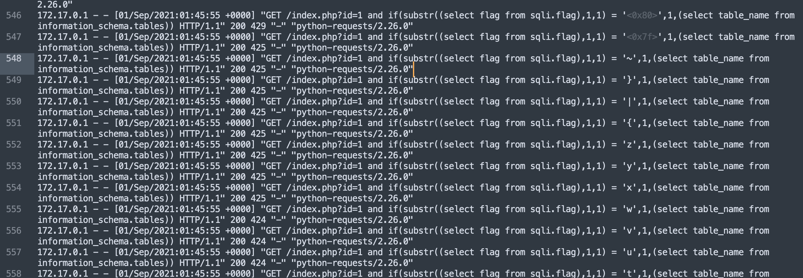
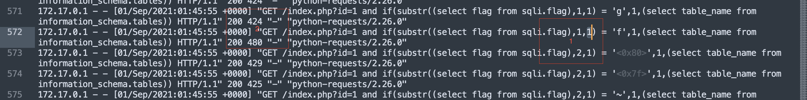
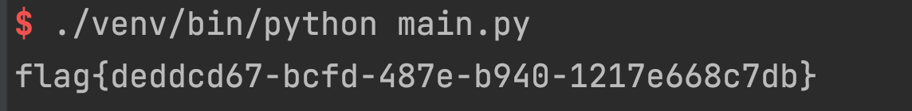

# sql注入
## 0x01 文件分析
解压zip文件获得access.log，access.log是apache,nginx等web中间件存放http请求的日志文件，应该是从http请求中获取flag，标题是sql注入，应该是从http请求中的sql注入语句中获取到flag


在nginx中对于一行日志的定义格式为
```shell
log_format  main  '$remote_addr - $remote_user [$time_local] "$request" '
                  '$status $body_bytes_sent "$http_referer" '
                  '"$http_user_agent" "$http_x_forwarded_for"';
```
空数据会被-替代，比如$remote_user一半不会输入则是-。
格式看清了，还有一个问题是url采用了url编码，很影响观感
访问http://tools.jb51.net/static/encodetxt/urlencode_decode/index.html 将url编码进行转换


这样基本确定是sql注入了，按照我们通常sql注入的方案来看先是数据库名，然后是表名，然后是列名，最后是存储的内容，flag应该是直接存放在数据库里的，那我们节省时间直接找到获取数据库的内容的那一行。

找到第一个字符串和第二个字符串的临界位置

方框1，是判断第一个字符到第二个字符，方框2会发现，正确的情况下http长度是480，错误是424，根据这个规律可以获取所有的flag。
我是不打算手工来的，写脚本提取现在有两种方案:
1. 用正则提取flag字母和长度，长度480的那个就是正确的flag字符。
2. 用正则提取索引和flag字母，判断n和n+1的位置。
我就用第二种吧。
## 0x02 编写脚本
还是根据规律编写脚本
```Python
import re
import os


def load_file(filename: str) -> list:
    line_list = []
    with open(filename, "r") as f:
        for line in f.readlines():
            line = line.replace(os.linesep, "")
            line_list.append(line)

    return line_list


# 利用正则提取索引和对应的值
match = re.compile(
    "if\(substr\(\(select flag from sqli.flag\),(.*?),1\) = '(.*?)',1,\(select table_name from information_schema.tables\)\)")

if __name__ == '__main__':
    lines = load_file("access.log")

    values = []
    for i in lines:
        findall = match.findall(i)
        if len(findall) > 0:
            values.append(findall[0])

    tmp = 1
    flag = []
    for j in range(len(values)):
        index, value = values[j]
        if int(index) != tmp:
            _, key = values[j - 1]
            flag.append(key)
            tmp = int(index)
    print("".join(flag))

```



