# 后门
## 0x01 协议分析
解压zip文件获得pcapng文件，使用wireshark打开

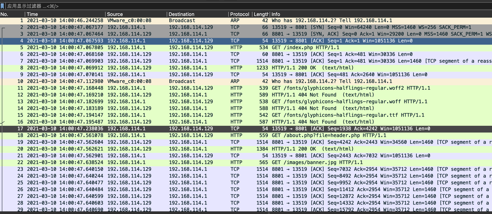
存在http信息，使用http关键词过滤
挨个看下来以后，发现存在POST包

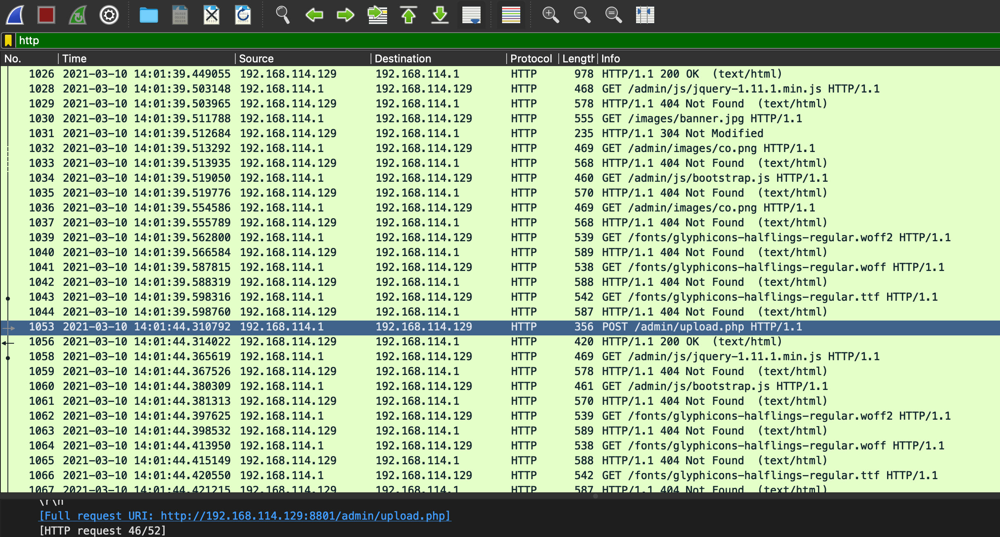
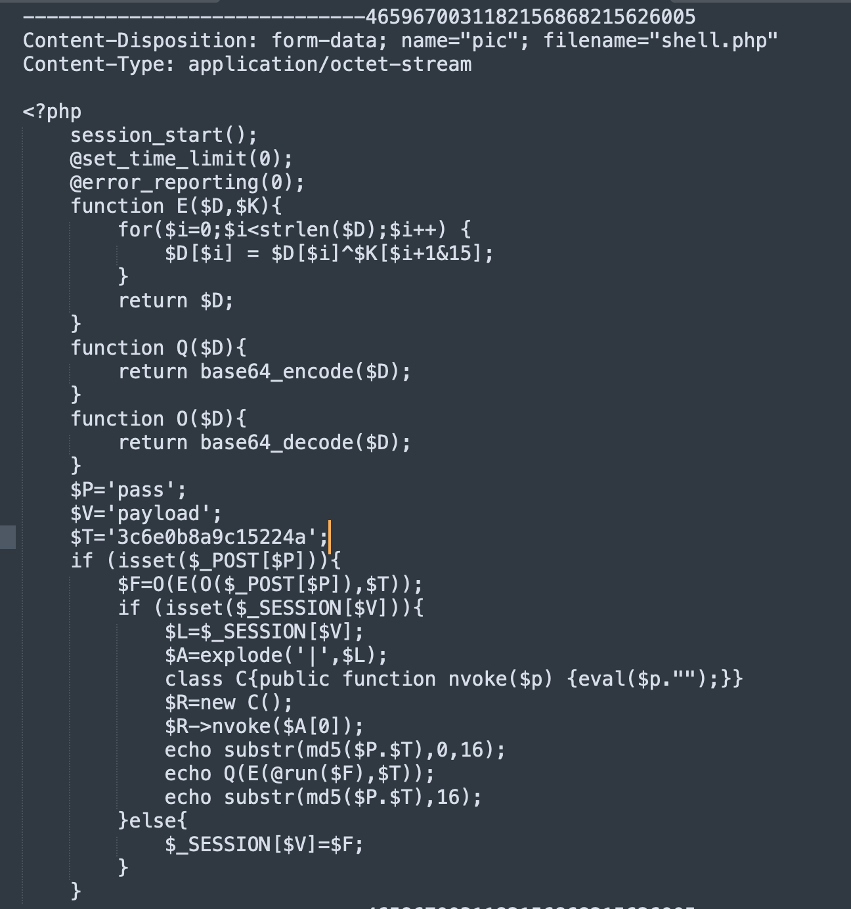
根据信息从网上查了一下发现是哥斯拉木马，只要根据哥斯拉的加解密方案将加密信息解出明文基本可以找到flag了。

## 0x02 数据解密
从网上找了哥斯拉木马的Python解密脚本
```python
import hashlib
import string
import itertools
import base64
import re
from urllib.parse import unquote


def md5(s):
    return hashlib.md5(s.encode("utf-8")).hexdigest()


def get_key(pw, s):
    for k in itertools.product(string.ascii_lowercase, repeat=5):
        key = "".join(k)
        c = md5(pw + md5(key)[:16])
        if c == s:
            return key


class Godzilla(object):
    def __init__(self, pw, key, md5key=False):
        super(Godzilla, self).__init__()
        self.pw = pw
        if md5key:
            self.key = key
        else:
            self.key = md5(key)[:16]

        findStrMd5 = md5(self.pw + self.key)
        self.findStrLeft = findStrMd5[:16]
        self.findStrRight = findStrMd5[16:]

    def findStr(self, t):
        s = re.search(self.findStrLeft + "(.*?)" + self.findStrRight, t)
        if s:
            return s.group(1)
        else:
            return t

    def decode(self, s):
        s = self.findStr(unquote(s))
        s = base64.b64decode(s)
        r = []

        for i in range(len(s)):
            k = s[i] ^ ord(self.key[i + 1 & 0xF])
            r.append(k)
        return base64.b64decode("".join(map(lambda x: chr(x), r))).decode('utf-8')

    def decodeResponse(self, s):
        return self.decode(s)

    def decodeRequest(self, s):
        s = self.decode(s)
        # request body like: cmdLine=a2V577yaSDFUQGN0ZiB8fCBpZA==&methodName=ZXhlY0NvbW1hbmQ=
        s = s.strip().split("&")
        body = ""
        for param in s:
            p = list(filter(lambda x: x, param.split("=")))
            if len(p) == 1:
                body += p[0] + "=&"
            elif len(p) == 2:
                body += p[0] + "=" + base64.urlsafe_b64decode(p[1] + '=' * (4 - len(p[1]) % 4)).decode('utf-8') + "&"
        return body[:-1]


if __name__ == '__main__':
    g = Godzilla('pass', '3c6e0b8a9c15224a', md5key=True)
    # g = Godzilla('shell', 'eddc7695c7f8260c', md5key=True)

    c1 = "11cd6a8758984163AQQWey4LO1EAWAwBVgcCRQJ+N0QAe1hROXYEQlBdWAIAcR1GO28wTy9GWkdgci9VNgU3RgFVNHMuYF5Lf3AoSy9iJEoubCROKnVwSH1eNAYsXCQBIWw4QS11UnhnWAVqIF9QVi5TM207AHsCUAcrXyBiIHovUiBALmIFRX9NUUsudSRIL0IOCCxlWkV8ZQpLLUw8ejdUBWAgWABUawZYRjlbCV4uViNWAHBeSnFgKEQuXCBEL3wsTS5ldFV/YCwFLWIOBi98NHMuZVYAcWIrazR3CkgsbCxALHVgSn9eAgECWCtGAF8KQSBlfEV/XiRHLnIoRC9sIF4uZXgEfGAKBS5yMHoteQ1qNQBSeX9gNEkuXAIBL2woDC1yAEVTfCB5LmcOSS98KEEvZXRIfmAkRCpyIEotUjQMLFt0A3FgBnk2WgFpIVIkCC5LfAZ8YCRJLmI8RQF/CU4gZXB4f14gSi5lVUcvQVFBLnJ0Sn9ODgIsYgpHLGkKQSxgWWFkBQZ4LmI8SCxsLA0tdV5FfHdURAJ+JHovaQpALnV8Sn5gIEkvYiBHK3wkCSxbdEp9XjADIGICAi1pDWo1RkUBVgcCRgZbCUchbCRzLlt0S39nUUQuT1VIL3sgQS11WkV/Xg4CLGcOSC9CKAwtS2BKcWIrayBRWA0=6c37ac826a2a04bc"
    print(g.decodeResponse(c1))
    # c2 = 'PVZSXGJ%2BWRZtMglae1w6VCoeBwJvb3smZQpuYGQAVxIzCQ90eX5vJ2YIelNnZFNcLglSW1J%2BXRVtIw1aVGc2XDMIC1hUf14UYwhiW2BKJQo9CVJlZmgIXg%3D%3D&5Ye66aKY5Lq66K+077ya6KaB5LuU57uG5YiG5p6Q5rWB6YeP5ZOm77yB'
    # print(g.decodeRequest(c2))
```

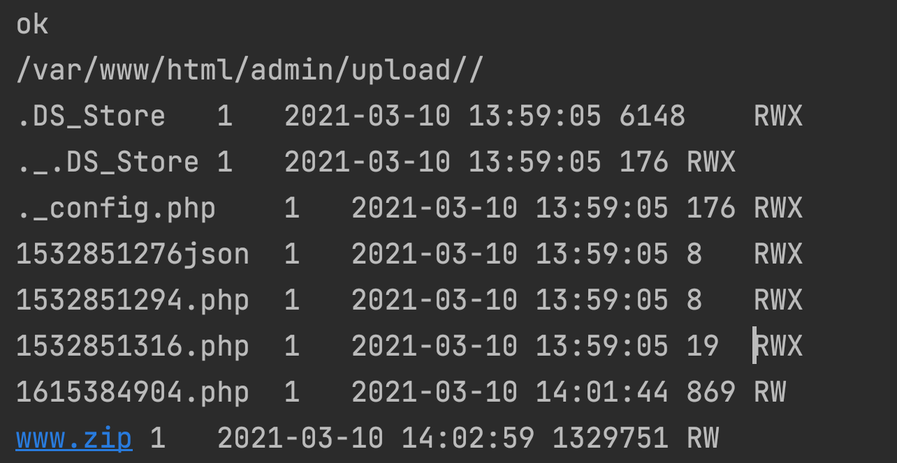
回到wireshark数据包，发现了一个www.zip文件，需要将这个二进制文件保存出来
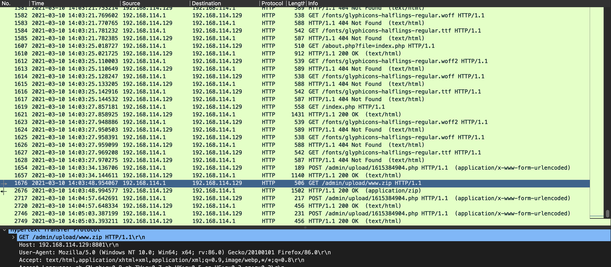
将文件以16进制数据流的形式复制
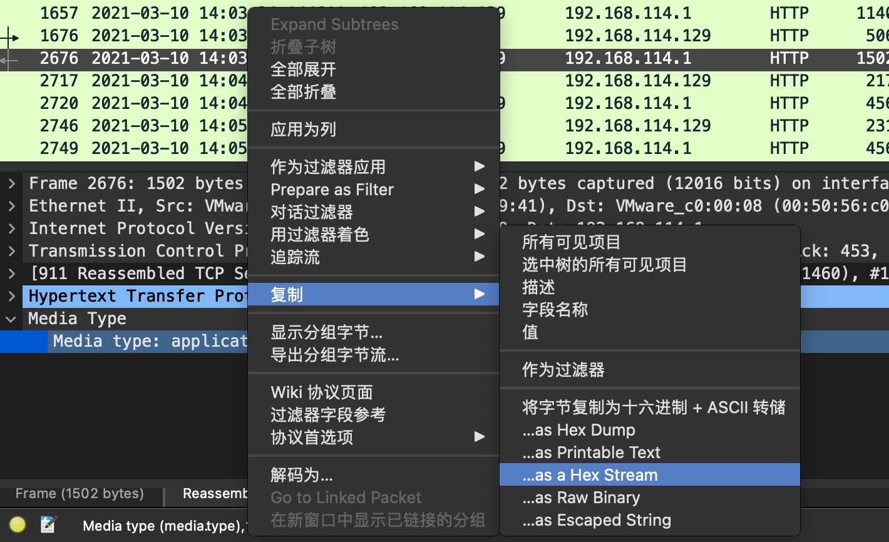

然后在010editor中粘贴
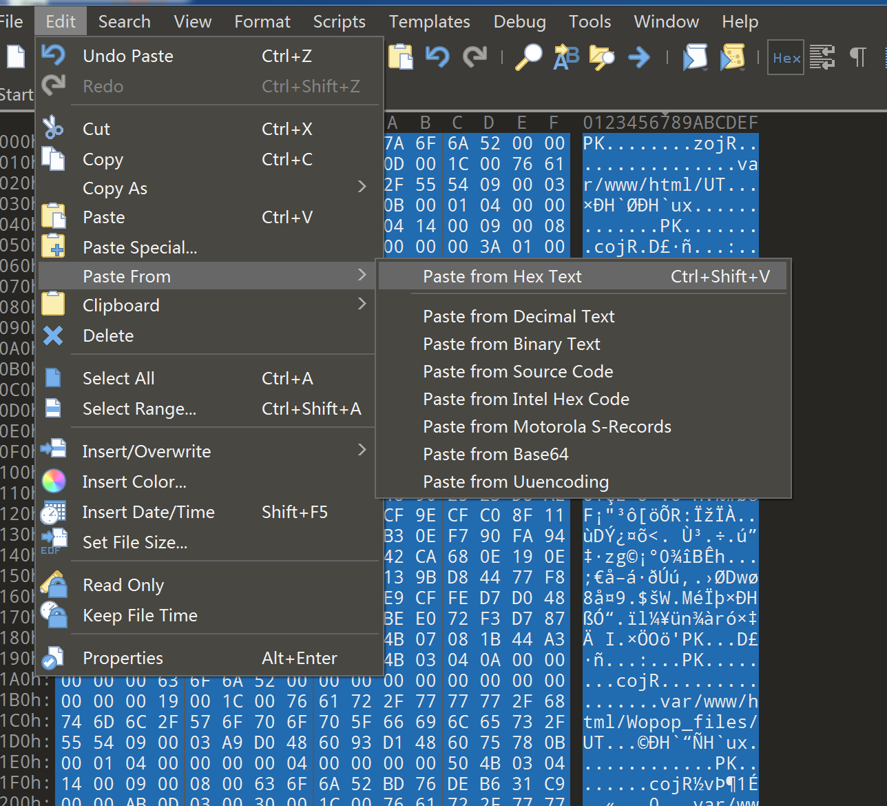
将文件保存为zip文件
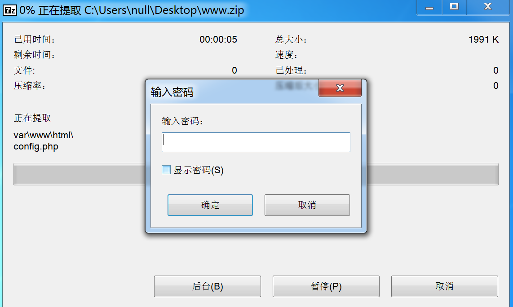
上溯流量请求,挨个解密过来
```python
import hashlib
import string
import itertools
import base64
import re
from urllib.parse import unquote


def md5(s):
    return hashlib.md5(s.encode("utf-8")).hexdigest()


def get_key(pw, s):
    for k in itertools.product(string.ascii_lowercase, repeat=5):
        key = "".join(k)
        c = md5(pw + md5(key)[:16])
        if c == s:
            return key


class Godzilla(object):
    def __init__(self, pw, key, md5key=False):
        super(Godzilla, self).__init__()
        self.pw = pw
        if md5key:
            self.key = key
        else:
            self.key = md5(key)[:16]

        findStrMd5 = md5(self.pw + self.key)
        self.findStrLeft = findStrMd5[:16]
        self.findStrRight = findStrMd5[16:]

    def findStr(self, t):
        s = re.search(self.findStrLeft + "(.*?)" + self.findStrRight, t)
        if s:
            return s.group(1)
        else:
            return t

    def decode(self, s):
        s = self.findStr(unquote(s))
        s = base64.b64decode(s)
        r = []

        for i in range(len(s)):
            k = s[i] ^ ord(self.key[i + 1 & 0xF])
            r.append(k)
        return base64.b64decode("".join(map(lambda x: chr(x), r))).decode('utf-8')

    def decodeResponse(self, s):
        return self.decode(s)

    def decodeRequest(self, s):
        s = self.decode(s)
        # request body like: cmdLine=a2V577yaSDFUQGN0ZiB8fCBpZA==&methodName=ZXhlY0NvbW1hbmQ=
        s = s.strip().split("&")
        body = ""
        for param in s:
            p = list(filter(lambda x: x, param.split("=")))
            if len(p) == 1:
                body += p[0] + "=&"
            elif len(p) == 2:
                body += p[0] + "=" + base64.urlsafe_b64decode(p[1] + '=' * (4 - len(p[1]) % 4)).decode('utf-8') + "&"
        return body[:-1]


if __name__ == '__main__':
    g = Godzilla('pass', '3c6e0b8a9c15224a', md5key=True)
    # g = Godzilla('shell', 'eddc7695c7f8260c', md5key=True)

    # c1 = "OVsJQzhtVFEBZmALZnAvUgJxK0AtbC9SLgN7AGthCWAHcS90LW9QUC5bXkVlWAl5B2EreANwAlQBZmMCU3NYWDdbI0Q4bFBTAWdvXWVfN1IAcS94NFMzUC5bYEVlWAICLndYDQ=="
    # print(g.decodeResponse(c1))
    c2 = 'OgRUWzZ%2FDUw5ZQReUGMZADBjDVsvCjMMLWVvWmVxJ103cA17N20NfTZaf2RgYTt2NgYzZzhUN0o1Wgxrf2I7ZjZaP3o4CBZDNFxdWFNgCkk5citaBlUncDZfZ1tjTgl%2FKVtUXAZ%2FCU85dABaUGM0CjRaDV8AfgpON19vW2ROJ1w6W1RiMmlcBA=='
    print(g.decodeRequest(c2))

```
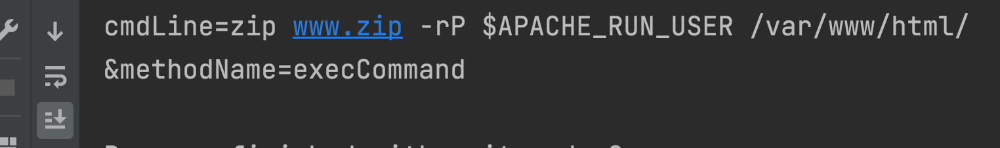
密码用的是apache的用户名，又翻了很久终于到了用户信息，密码是www-data
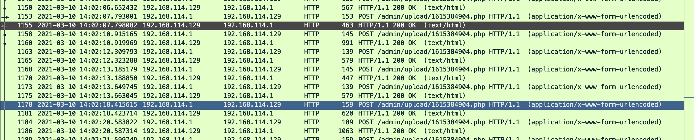

成功解压zip文件获得flag
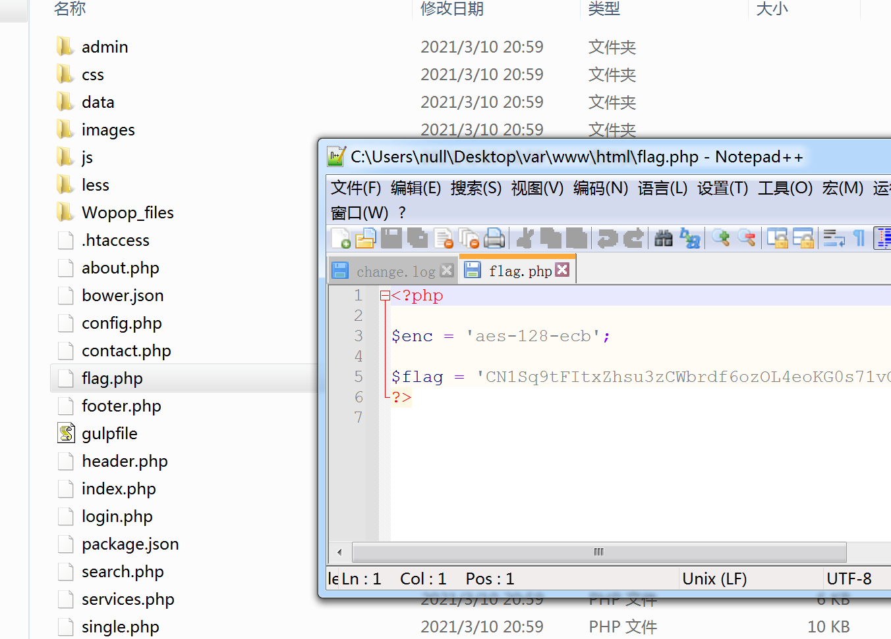


